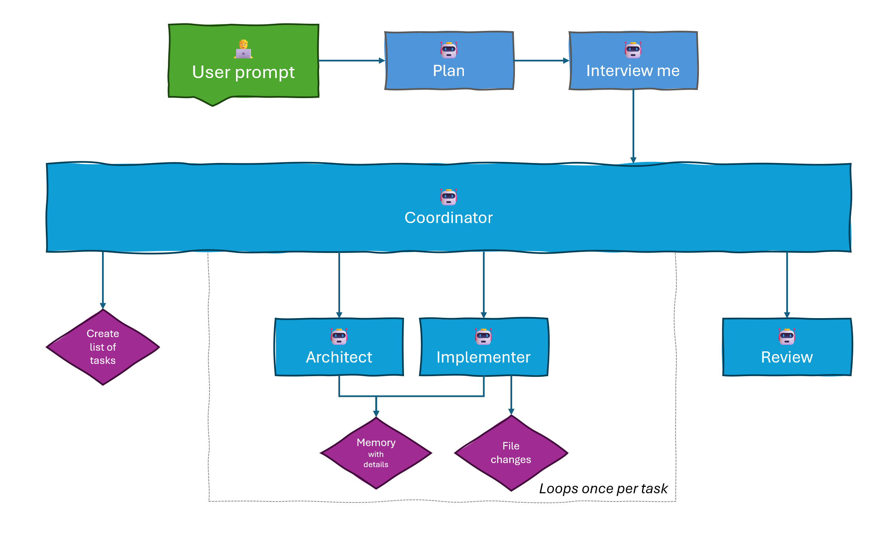

# Plan-Ask-Build template

Github Copilot agent prompt templates that I use and experiment with.



## Usage

The templates consist of 3 main parts, and you can mix and match as you like.

### 1. Plan

- Start by running the `1 - Create Plan` agent.
- Enter a good prompt for what you want to achieve.

### 2. Ask

- Once the plan is done you should see a `Interview me` button. Or you can select the `2 - Interview me for plan` agent and enter "Interview me".
- This agents task is to ask questions and refine the plan based on what you choose.

### 3. Build

- Once the plan is ready to can start the `3 - Implement plan` agent.
- This agents task is to coordinate throughout the phases and run `architect` and `implementer` for each phase.
- Once all phases are done it will run the `review` agent.

## Goals for this template

- **Context control** - Each subagent has a fresh context, so no context from one phase/subagent uses up the context window for another.
- **Focus** - Each agent in this setup only has one goal to focus on. Architect is tasked with finding out how, implementer is tasked with making it work.
- **Performance** - `architect` and `implementer` both share the same tools so that we get better performance due to prompt caching.
- **Modularity** - Do `Plan -> Build`, `Plan -> Ask -> Build`, `Plan -> Agent` or just call the `Build directly`. It's all up to you.

## Installation

### Put the files in your prompts folder:
```
Workspace:      <workspace>/.github/promps/
Code:           %appdata%/Code/User/prompts
Code-insiders:  %appdata%/Code - Insiders/User/prompts
```

### Copilot settings I use
```json
{
    "chat.customAgentInSubagent.enabled": true,
    "github.copilot.chat.tools.memory.enabled": true,
    "chat.useAgentSkills": true,
    "chat.agent.maxRequests": 500,
}
```